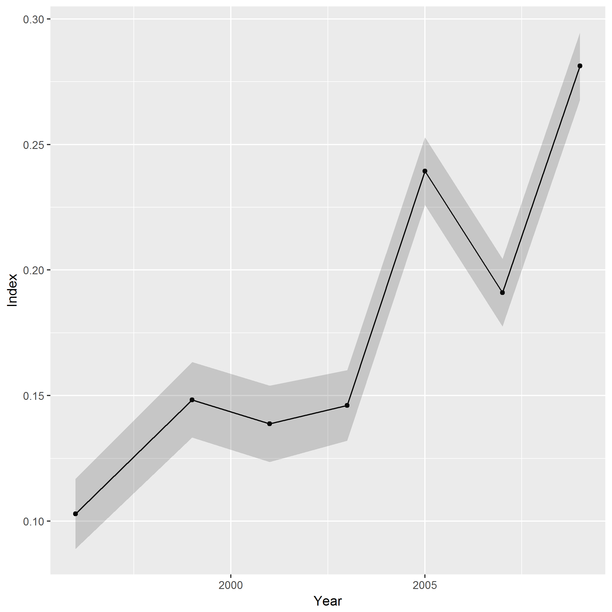

\newpage

```{r setup,include=FALSE}
knitr::opts_chunk$set(echo = TRUE)
library(devtools)
library(ggplot2)
library(pander)
library(magick)
library(dplyr)
library(data.table)
devtools::install_github("rooperc4/MEHRSI")
library("MEHRSI")
options(width=50, width.cutoff=50, digits = 3) 
```


##Purpose
The purpose of this document and its associated functions is to allow the user to compute annual indices of abundance from survey data using a habitat model based on Rooper and Martin (2012). It is designed to be a 2-stage model, with the first stage setting the biological limits for a species (such as depth ranges from 85-250 m for Pacific Ocean perch or geographical limits on Northern rockfish distribution). In the second stage a iterative modeling process fits CPUE data to habitat variables chosen by the user. Individual habitat variables are constrained to using one of 3 shapes for the fitting (dome, asymptotic or linear). Model fitting is completed using the optim function in R and parameters and variables are removed sequentially until there is no improvement in model AIC. Full details of the modeling and the manuscript can be found at https://www.st.nmfs.noaa.gov/spo/FishBull/1101/rooper.pdf and the preceeding papers where the method was developed (Rooper and Martin 2009 - http://www.int-res.com/articles/meps2009/379/m379p253.pdf, Rooper 2008 - http://fishbull.noaa.gov/1061/rooper.pdf, and Rooper and Zimmermann 2005 - http://www.int-res.com/articles/meps2005/290/m290p251.pdf).


***


##Setup data
###Define species of interest and habitat variables
This code is designed to be run with output from RACEBASE (or other data source) where rows represent hauls to be used in the calculation of the survey index and columns indicate CPUE for species (zero-filled data), habitat and other variables. An example is the data for juvenile Pacific Ocean perch included in the MEHRSI package.

```{r load data}
AI_data<-read.csv("//AKC0SS-N086/RACE_Users/chris.rooper/Desktop/HAIP Project - Survey Modeling Methods/Data_Analysis/Data_Prep/HISAdata/AI_data.csv",header=TRUE)
pander::pandoc.table(head(AI_data))

```

##PRESENCE-ABSENCE MODEL 

Int the first stage of the modeling, the idea is to reduce the number of zeros in the data set by looking at the overall presence of the species across variables that effect the distribution of fish on a large scale. 

```{r}
variables1<-c("bdepth","btemp","long")
years_pa<-unique(AI_data$year)
species.name<-c("POP_CPUE")

for(i in 1:length(species.name)){
  
```

Presence-absence limits

```{r}
data_pa<-cbind(AI_data[,(variables1)],AI_data[species.name[i]],AI_data["year"])
data_pa[species.name[i]]<-exp(data_pa[species.name[i]])-0.5*min(exp(data_pa[species.name[i]]))
data_pa <- data_pa[data_pa$year %in% years_pa,] #Subset those years in the year set that you want to use
limits1<-cdf_limits(data_pa[species.name[i]],data_pa[,(variables1)],1000,0.05)
pander::pandoc.table(limits1)
pred_pa1<-presence_absence(AI_data[,(variables1)],limits1,AI_data[species.name[i]])

```

##CATCH-PER-UNIT-OF-EFFORT MODEL

The second stage of the modeling is to use the habitat variables to fit the CPUE data to an abundance model. For this step another set of habitat variables can be used, or even the same set. The equations of the model come in three forms, a dome shaped polynomial curve with 3 parameters (a + b*X + c*X2), a exponential function with two parameters (a*X*exp(-b*X)), and a linear function (a*X) with one parameter.

```{r}
var1<-c("btemp","bdepth","slope","inverts","tmax","long")
```

 In these equations X is the habitat variable. Initially, the model needs to know what form the equations should take for each variable (3, 2 or 1 respecitively). To do this, you set up a vector that corresponds to the vector of habitat variables with the form for each. Usually, you will want to start with the three parameter version and then interatively remove parameters and variables. 

```{r}
forms1<-c(3,3,3,3,3,3)

```

For computation of survey indices, the column containing the year data must also be identified. Then an object is constructed to provide the initial values for the parameters of the model. In this case we start with all parameters = 0. There is a set of parameters for each of the equations in the model forms and also a single parameter for each year in the model.

```{r}
year1<-AI_data["year"]
par1<-rep(0,(sum(forms1)+length(unlist(unique(year1)))))
```

Next we set up the CPUE data. In the case of juvenile POP (and most of the other survey species) the data are not normally distributed. We used a log-transformation with thte addition of 1/2 the minimum positive catch to come closest to normality. Other data transformations can be used here. For convenience sake we also attached the new log-CPUE back to the data frame.

```{r}
ob_CPUE1<-unlist(AI_data[species.name[i]])
#minob<-min(subset(ob_CPUE1,ob_CPUE1>0))*.5
#ob_CPUE1<-log(ob_CPUE1+minob)
#Juvenile_POP_Data["lnjpop"]<-ob_CPUE1
```

Finally, we specify how many non-parametric bootstraps of the data will be used to compute the error around the survey index. In this case (and by default) it is 500. 

```{r}
boot1<-500
```

At this point you are ready to fit the model. The model is fit using the iteration function. It requires the list of names of habitat variables to be used in the CPUE model (vars1), the initial forms of the model (forms1), the observed CPUE of the species (ob_CPUE1), the predicted presence or absence from the presence-absence model (pred_pa1), the starting values for parameters (par1) and the variable indicating the year of the survey (year1). The model is fit using a call to the optimiz function and then iteratively it reduces the number of parameters and the number of variables in the model until the lowest AIC is attained. It returns a number of variables in a list. In this case we will return the predicted CPUE and the residuals and attach them to our data frame.

```{r,message="hide",eval=FALSE}
POPmodel<-iteration(AI_data[,(var1)],forms1,ob_CPUE1,pred_pa1,par1,year1)
POPdata_out<-data.frame(AI_data,pred_pa1,best_PCPUE=POPmodel$best_PCPUE,resids=POPmodel$resids)
head(POPdata_out)
```

```{r, echo=FALSE}


```

Next we bootstrap some errors by resampling the data to produce the index and associated variability. 

```{r,message="hide", eval=FALSE}

index_error<-boot_survey_error(jpopmodel,boot1,year1,Juvenile_POP_Data[,(var1)],pred_pa1,ob_CPUE1)

``` 

Finally, we take all the pieces and put them together to calculate the index of abundance. For this function, it is assumed you have used the log-transformation with the addition of the minimum observation. For other transformations, a modification of this function is needed.

```{r,eval=FALSE}
JpopIndex<-index_calc(index_error[[2]],jpopmodel[["best_model"]],jpopmodel[["best_parameters"]],Juvenile_POP_Data[,(var1)],year1,minob,boot1)
```
```{r, echo=FALSE}

```

Look for any significant spatial patterns in the residuals, by fitting a kriging model and adding back into the predicted CPUE


```{r,eval=FALSE}
spatial_resids(Juvenile_POP_Data$long,Juvenile_POP_Data$lat,jpopdata_out$resids,jpopdata_out$best_PCPUE,ob_CPUE1,region="GOA")
```

```{r, echo=FALSE,fig.showtext=FALSE, fig.cap="Spatial patterns and correlations among residuals"}

```